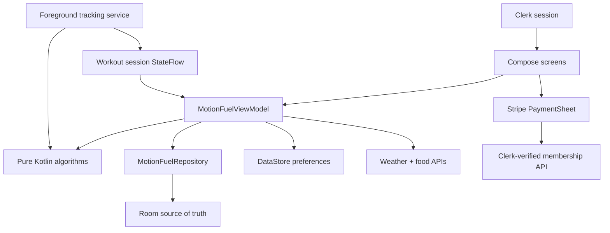

# MotionFuel — assessed MVP foundation

MotionFuel is a context-aware Android fitness and nutrition companion built from the supplied PRD. This runnable vertical slice combines the sensor, localisation, offline data, privacy, external-data and adaptive-insight experience with Clerk identity and Stripe membership seams.

## What is implemented

- A polished Jetpack Compose interface with Today, Activity, Food, Insights and Profile destinations.
- Clerk-backed email/password sign-in, sign-up, email verification and secure session gating.
- Stripe PaymentSheet subscriptions, server-verified membership state and Customer Portal access.
- Real walk/run tracking in an Android foreground service.
- Accelerometer, gyroscope, step-counter and optional pressure-sensor sampling.
- Platform GPS tracking with accuracy validation, Haversine distance, impossible-jump rejection, stationary-drift rejection and lightweight smoothing.
- A hybrid stationary/walking/running classifier with confidence, evidence and two-window hysteresis.
- Live duration, filtered route, distance, pace, cadence, elevation, calorie estimate, activity state and GPS quality.
- A debug-only assessor trace that replays a stationary start, walk, run, fake GPS jump, hill and pace decline.
- Eight transparent Adaptive Fuel & Effort Engine (AFEE) rules, ranked to at most two current insights.
- Expandable “Why am I seeing this?” evidence on every generated insight.
- Offline-first Room storage for workouts and nutrition entries.
- DataStore preferences for units, theme and detailed-route backup consent.
- Open-Meteo weather context and Open Food Facts search, each with a no-network fallback.
- Manual nutrition entry and live daily macro totals.
- Privacy-zone route masking preview and route-backup opt-in (off by default).
- Unit tests for GPS filtering, sensor fusion/hysteresis, AFEE ranking and spatial privacy masking.

## Open and run

1. Extract the archive and open the **MotionFuel** folder—the one containing `settings.gradle.kts`—in Android Studio.
2. Allow Gradle sync to finish. The project pins Android Gradle Plugin 9.0.1 and Gradle 9.1.0. Gradle 9.1 supports running on Java 25, but Android Studio’s Embedded JDK 17 or 21 remains the least surprising choice.
3. If prompted, install Android SDK 36.
4. Follow the exact key-location table in [docs/CLERK_STRIPE_SETUP.md](docs/CLERK_STRIPE_SETUP.md), then copy `secrets.properties.example` to `secrets.properties` and add only the client-safe values.
5. Select the `app` module and the `debug` build variant.
6. Run on an Android 10+ emulator or device. Without a Clerk publishable key, the app intentionally shows a setup screen rather than bypassing authentication.

The included wrapper JAR is a small transparent bootstrap whose source is beside it at `gradle/wrapper/GradleWrapperMain.java`. It accepts only the pinned HTTPS Gradle distribution URL, downloads it once, and delegates the build.

The project uses KSP 2.3.6 for Room code generation. This version is compatible with AGP 9 built-in Kotlin and avoids the legacy `kotlin.sourceSets` configuration error. Do not add `android.disallowKotlinSourceSets=false`; that only hides an outdated-plugin incompatibility.

## Fast assessor demo

1. Open **Today** and tap **Start walk or run**.
2. Select **Run assessor demo**. This button exists only in debug builds.
3. Watch the activity state stabilise, the route grow, elevation rise and the fake GPS jump get rejected.
4. Tap **Why am I seeing this?** on an insight to reveal its evidence.
5. Finish the workout. The summary is saved to Room before any cloud work.
6. Open **Activity** to verify offline history, **Food** to log nutrition, and **Profile** to preview privacy masking.

For a real outdoor test, choose **Use real sensors**, grant location/activity/notification access and keep the device outdoors while a usable GPS fix is acquired. Missing optional sensors degrade gracefully.

## Build and test commands

On Windows:

```powershell
.\gradlew.bat testDebugUnitTest
.\gradlew.bat assembleDebug
```

On macOS/Linux:

```bash
./gradlew testDebugUnitTest
./gradlew assembleDebug
```

The debug APK will be written beneath `app/build/outputs/apk/debug/`.

## Architecture



The algorithms contain no Compose or database dependencies, which keeps them deterministic and directly unit-testable. Raw sensor callbacks stay in the service; the UI observes a low-frequency immutable workout model.

## Intentional milestone boundary

Clerk authentication and Stripe memberships are wired and require your publishable keys plus deployment of the included membership API. Cross-device workout sync, WorkManager retry and a licensed map provider remain the next milestone. The existing Room source-of-truth, `syncState` fields, route-backup consent and user-scoped cloud rules are ready for that work.

See [docs/NEXT_MILESTONE.md](docs/NEXT_MILESTONE.md) for the exact implementation order.

## Privacy and safety

- Detailed route backup defaults to off.
- Android Auto Backup excludes the database and settings file.
- API traffic uses HTTPS.
- No API keys or secrets are committed.
- Clerk and Stripe publishable keys are read from ignored local configuration; all secret keys remain server-side.
- Membership access is read from Stripe subscription state after the server verifies a Clerk JWT.
- Insights are wellness-oriented estimates and explicitly avoid diagnosis or treatment claims.
- The application requests permissions contextually when real tracking starts.
