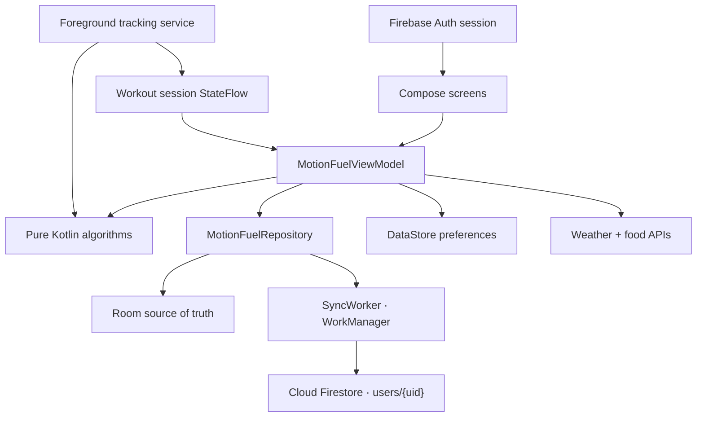

# MotionFuel

MotionFuel is a context-aware Android fitness and nutrition companion. It is local-first (Room is the source of truth) with per-user Cloud Firestore sync, Firebase Authentication as the identity gate, live GPS workout tracking, Mifflin–St Jeor maintenance-calorie estimation, and calorie/macro logging with a calorie-history chart.

The project builds and runs green with **no configuration**: without `google-services.json` it shows a "configure Firebase" gate; without a Maps key it draws routes on an offline canvas; food search works with no key.

## What is implemented

- Jetpack Compose + Material 3 UI with five destinations: **Today · Activity · Food · Progress · Profile**.
- **Firebase Authentication** (email/password, password reset, optional verification) as the sole identity system and app-start gate.
- Multi-step **Sign Up** (name, age, sex, height, weight, activity level) computing **Mifflin–St Jeor BMR + activity-factor TDEE** as estimated maintenance calories, shown separately from an editable daily calorie goal.
- **Direct-client Cloud Firestore** at `users/{uid}/…`, protected by Security Rules (`request.auth != null && request.auth.uid == userId`).
- Breakfast/Lunch/Dinner/Snack logging with % of daily goal, macro totals, **Custom Meal** (macros + 4/4/9 calorie prefill + optional local photo) and Open Food Facts search.
- A **7/30-day calorie bar chart** (Compose Canvas) with historical target snapshots.
- Real walk/run tracking in a foreground service: GPS with accuracy validation, Haversine distance, impossible-jump and stationary-drift rejection, plus a stationary/walking/running classifier.
- **Google Maps Compose** live/saved route when `MAPS_API_KEY` is configured, with an offline `RouteMap`/`RouteCanvas` fallback otherwise.
- Weight tracking with trend (UP/DOWN/FLAT), Progress and Maintenance-detail screens.
- Offline-first Room storage draining a `syncState` queue to Firestore with WorkManager.
- DataStore preferences for units, theme and detailed-route backup consent.
- Open-Meteo weather from the device's last known location, with clear offline status.
- Privacy-zone route masking preview and route-backup opt-in (off by default).
- Unit tests for GPS filtering, sensor fusion/hysteresis, insight ranking, privacy masking, and the maintenance/nutrition/weight-trend algorithms.

## Open and run

1. Open the **MotionFuel** folder (the one containing `settings.gradle.kts`) in Android Studio.
2. Let Gradle sync finish. Use the Embedded JDK 17 or 21.
3. Install Android SDK 36 if prompted.
4. (Optional) Follow [docs/FIREBASE_SETUP.md](docs/FIREBASE_SETUP.md) to enable auth + cloud sync, and copy `secrets.properties.example` to `secrets.properties` to add a client-safe `MAPS_API_KEY`.
5. Select the `app` module and the `debug` variant.
6. Run on an Android 10+ emulator or device. Without Firebase configured the app shows a setup gate rather than bypassing authentication.

## Build and test commands

macOS/Linux:

```bash
./gradlew testDebugUnitTest assembleDebug
```

Windows:

```bash
gradlew.bat testDebugUnitTest assembleDebug
```

The debug APK is written beneath `app/build/outputs/apk/debug/`.

## Architecture



The algorithms contain no Compose or database dependencies, keeping them deterministic and directly unit-testable. Raw sensor callbacks stay in the service; the UI observes a low-frequency immutable workout model.

## Privacy and safety

- Detailed route backup defaults to off; the detailed route is uploaded only when the toggle is on.
- Firestore Security Rules restrict every private document to its owner (`request.auth.uid == userId`); ownership is derived from the authenticated user, never a client-supplied field.
- Custom Meal photo URIs are local-only and never uploaded.
- Raw high-frequency sensor traces are never uploaded.
- Android Auto Backup excludes the database and settings file.
- API traffic uses HTTPS. No API keys or secrets are committed; `google-services.json` and `secrets.properties` are git-ignored.
- The Maps key is client-safe and restricted by SHA-1 + package name in the Google Cloud console.
- Insights are wellness-oriented estimates and explicitly avoid diagnosis or treatment claims.
- Permissions are requested contextually when real tracking starts.
